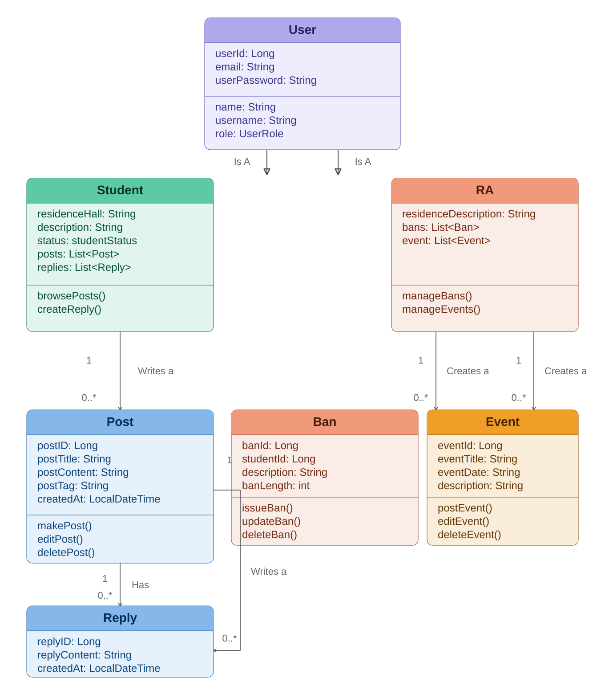

# NextDorm - Backend API Documentation

**Version:** 1.0
**Last Updated:** March 23, 2026
**Base URL:** `http://localhost:8080/api`

---
## Table of Contents

1. [Overview](#1-overview)
2. [User Roles](#2-user-roles)
3. [UML Class Diagram](#3-uml-class-diagram)
4. [API Endpoints](#4-api-endpoints)
   - [Student Management](#student-management)
   - [RA Management](#ra-management)
   - [Post Management](#post-management)
   - [Reply Management](#reply-management)
   - [Event Management](#event-management)
   - [Ban Management](#ban-management)
5. [Use Case Mapping](#5-use-case-mapping)

---
## 1. Overview

NextDorm Backend API provides REST endpoints for a campus community platform where students and resident advisors (RAs) can register, post messages, comment, manage events, and enforce community rules.

Core domains:
- **Users**: Students and RA profiles, authentication data.
- **Posts**: Community posts created by any authorized user.
- **Replies**: Comments for posts.
- **Events**: RA announcements and community activities.
- **Bans**: RA-driven temporary bans for community misuse.

---
## 2. User Roles

| Role | Description | Primary Responsibilities |
|------|-------------|--------------------------|
| **STUDENT** | In-app community resident | register, login, create posts, comment, browse events |
| **RA** | Resident Advisor / moderator | register, login, create posts/events, ban users, moderate community |

---
## 3. UML Class Diagram


---
## 4. API Endpoints

### Student Management
 <!-- Student info goes here! -->

---

### RA Management

#### Create RA
**Endpoint:** `POST /ras`
**Use Case:** US-PROV-001 (Create RA Profile)
**Description:** Register a new RA account.

```http
POST /ras
Content-Type: application/json

{
	"residenceDescription": "North Hall - 2nd Floor",
	"bans": null,
	"event": null,
	"email": "johnson@uncg.edu",
	"name": "Alex Johnson",
	"role": "RA",
	"userId": 9,
	"userPassword": "SecurePass123!",
	"username": "ra_johnson"
}
```

**Status Code:** 201 Created

#### Get All RAs
**Endpoint:** `GET /ras`
**Status Code:** 200 OK

#### Get RA by ID
**Endpoint:** `GET /ras/{id}`
**Status Code:** 200 OK / 404 Not Found

#### Get RA by Building
**Endpoint:** `GET /ras/building/{building}`
**Status Code:** 200 OK

#### Get RA by Staff ID
**Endpoint:** `GET /ras/staff/{staffId}`
**Status Code:** 200 OK / 404 Not Found

#### Update RA
**Endpoint:** `PUT /ras/{id}`
**Status Code:** 200 OK / 404 Not Found

#### Delete RA
**Endpoint:** `DELETE /ras/{id}`
**Response:** "RA with ID {id} has been deleted."
**Status Code:** 200 OK

---

### Post Management
<!-- Post info goes here! -->

---

### Reply Management
<!-- Reply info goes here! -->

---

### Event Management

#### Create Event
**Endpoint:** `POST /events`
**Use Case:** US-PROV-004
**Description:** RA posts a global event/announcement.

```http
POST /events
Content-Type: application/json

{
  "organizationName": "North Hall RAs",
  "eventDate": "2026-04-01",
  "location": "North Hall Front Lawn",
  "description": "Mandatory fire drill for all residents",
  "ra": { "userId": 9 }
}
```

**Status Code:** 201 Created

#### Get All Events
**Endpoint:** `GET /events`
**Status Code:** 200 OK

#### Get Event by ID
**Endpoint:** `GET /events/{id}`
**Status Code:** 200 OK / 404 Not Found

#### Get Events Created by Specific RA
**Endpoint:** `GET /events/ra/{raId}`
**Status Code:** 200 OK

#### Get Events by Title Substring
**Endpoint:** `GET /events/search?title={title}`
**Status Code:** 200 OK

#### Update Event by ID
**Endpoint:** `PUT /events/{id}`
**Status Code:** 200 OK 

#### Delete Event by ID
**Endpoint:** `DELETE /events/{id}`
**Response:** "Event with ID {id} has been deleted."
**Status Code:** 200 OK

---

### Ban Management

#### Create Ban
**Endpoint:** `POST /bans`
**Use Case:** US-PROV-005
**Description:** RA bans a user from posting/replying for a period.

```http
POST /bans
Content-Type: application/json

{
  "studentId": 1,
  "ra": { "userId": 9 },
  "description": "Violation of community guidelines",
  "banLength": 30
}
```

**Status Code:** 201 Created

#### Get All Bans
**Endpoint:** `GET /bans`
**Status Code:** 200 OK

#### Get Ban by ID
**Endpoint:** `GET /bans/{id}`
**Status Code:** 200 OK / 404 Not Found

#### Get All Bans For a User
**Endpoint:** `GET /bans/user/{userId}`
**Status Code:** 200 OK

#### Get Active Bans
**Endpoint:** `GET /bans/active`
**Status Code:** 200 OK

#### Get Bans Issued by RA
**Endpoint:** `GET /bans/ra/{raId}`
**Status Code:** 200 OK 

#### Update Ban by ID
**Endpoint:** `PUT /bans/{id}`
**Status Code:** 200 OK

#### Lift / Deactivate Ban
**Endpoint:** `PUT /bans/{id}/lift`
**Status Code:** 200 OK

#### Delete Ban by ID
**Endpoint:** `DELETE /bans/{id}`
**Response:** "Ban with ID {id} has been deleted."
**Status Code:** 200 OK

---

## 5. Use Case Mapping

| Use Case | Description | Related Endpoints |
|----------|-------------|-------------------|
| US-PROV-001 | Create RA profile | `POST /ras`, `PUT /ras/{id}` |
| US-PROV-002 | Login as RA | `POST /ras/login` (assumed) |
| US-PROV-003 | Create post as RA | `POST /posts` |
| US-PROV-004 | Global announcements | `POST /events` |
| US-PROV-005 | Block user | `POST /bans` |
| US-PROV-006 | Tag a post as RA | `PUT /posts/{id}` (tags) |
